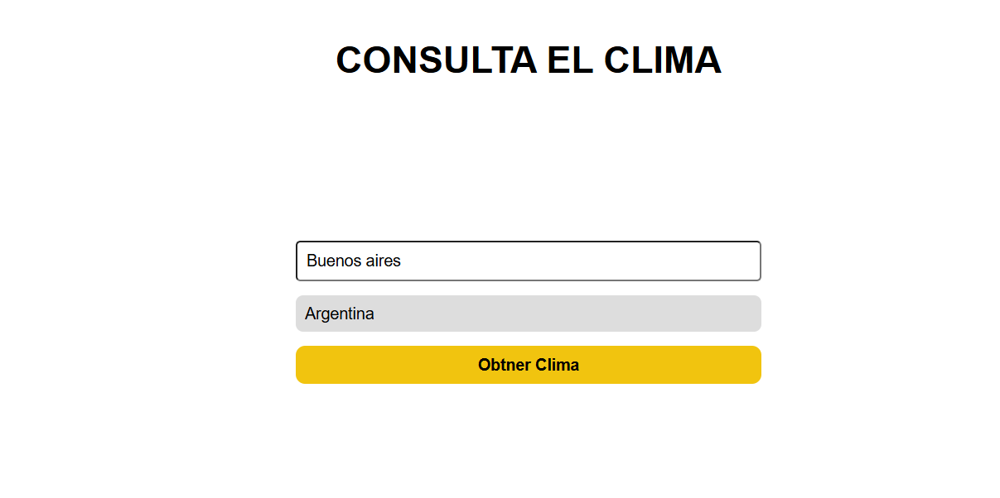

# Weather App 🌦️

Un proyecto funcional que consume la API de OpenWeatherMap para mostrar el clima de diferentes ciudades alrededor del mundo.

---

## 🚀 Características

- 🌍 Consulta el clima por ciudad y país
- 📊 Muestra temperatura actual, máxima y mínima
- ⚠️ Sistema de notificaciones para errores
- 🌡️ Conversión automática de Kelvin a Celsius

---

## 🛠️ Construido con

   

---

## 📸 Vista previa



---

## 📂 Estructura de carpetas

```
Weather-App/
│
├── index.html      # Archivo principal HTML
├── style.css       # Estilos CSS
├── app.js          # Lógica JavaScript
└── preview.png     # Capturas de pantalla

```

---

## 🙋 Acerca de mi

- 🐤 [_Twitter_](https://x.com/Gabiitto_)
- 💼 [_LinkedIn_](https://www.linkedin.com/in/velozogabriel/)
- 📷 [_Instagram_](https://www.instagram.com/gabittovelozo/?hl=es)
- 😺 [_GitHub_](https://github.com/Gabrielvelozo)
